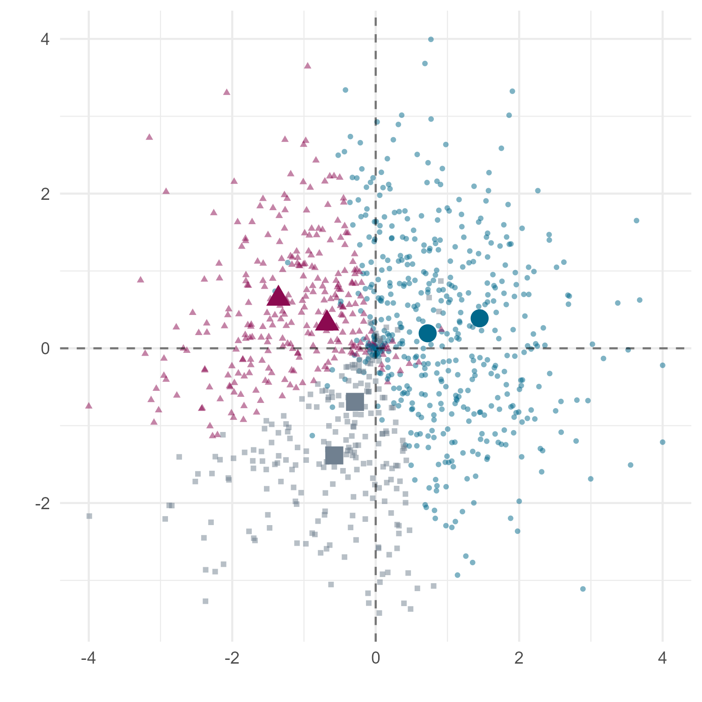

# `neodowns`: Simulating Candidate Competition in Group-Based Elections

`neodowns` Performs computer simulations of candidate competition under different electoral systems based on the spatial model proposed in Atsusaka and Landsman (2024). Working Paper. 

# Installation

`neodowns` can be installed using the following code:

``` r
remotes::install_github(
  "YukiAtsusaka/neodowns",
  dependencies = TRUE
)
```

# Example

Our workhorse function `sim_data` simulates spatial positions of voters and candidates under a set of conditions defined by model parameters. `neodowns` implements the algorithm based on the neodownsian model of candidate competition.

## Simulate candidate and voter positions

``` r
# Generate simulated data
sim <- sim_data(N_voters = 1000,
                N_groups = 3,
                dist = "Normal")
                
library(ggplot2)                
voters <- sim$gen_voters
cands <- sim$gen_cands

ggplot() +
  geom_point(data = voters,
             aes(x, y,
                 shape = ethnic_group,
                 color = ethnic_group),
             size = 1, alpha = 0.5) +
  geom_point(data = cands,
             aes(x, y,
                 shape = ethnic_group,
                 color = ethnic_group),
             size = 4) +
  geom_hline(aes(yintercept = 0), color = "black", alpha = 0.5, linetype = "dashed") +
  geom_vline(aes(xintercept = 0), color = "black", alpha = 0.5, linetype = "dashed") +
  scale_color_manual(
    values = c(
      alpha("deepskyblue4", 1),
      alpha("deeppink4", 1),
      alpha("slategray", 1)
    ),
    name = "Group", labels = c("Group A", "Group B", "Group C")
  ) +
  scale_shape_manual(
    name = "Group", labels = c("Group A", "Group B", "Group C"),
    values = c(16, 17, 15)
  ) +
  theme_minimal() +
  theme(legend.position = "none") +
  ylab("") +
  xlab("")
  
ggsave("man/fig/example-plot.png", height = 5, width = 5)  
```



## Performs simulations based on the neodownsian model

``` r

# Implement the algorithm
out <- neodowns(sim, n_iter = 1000)                

head(out)
# $voters
# # A tibble: 57,000 × 39
#    group ethnic_group      x      y    D1    D2    D3    D4    D5
#    <dbl> <chr>         <dbl>  <dbl> <dbl> <dbl> <dbl> <dbl> <dbl>
#  1     1 Group 1       0.477  0.426 0.363 1.17  1.36  0.998 1.82 
#  2     2 Group 2      -0.369 -0.118 1.14  0.562 0.564 1.91  1.23 
#  3     3 Group 3       0.157 -0.547 0.922 1.23  0.486 1.62  1.90 
#  4     3 Group 3      -0.213 -0.728 1.31  1.17  0.108 2.02  1.77 
#  5     2 Group 2      -1.39   0.953 2.26  0.928 1.96  2.92  0.318
#  6     2 Group 2      -1.39   1.09  2.32  1.03  2.07  2.95  0.452
#  7     1 Group 1       1.34   0.416 0.650 2.03  1.98  0.139 2.68 
#  8     3 Group 3      -1.21  -1.80  2.76  2.20  1.43  3.46  2.44 
#  9     3 Group 3      -0.797 -1.15  2.02  1.50  0.677 2.74  1.87 
# 10     3 Group 3      -0.310 -2.83  3.18  3.20  2.15  3.68  3.62

# $cands
# # A tibble: 360 × 11
#    group ethnic_group      x      y type  party    dist moderation
#    <int> <chr>         <dbl>  <dbl> <chr> <chr>   <dbl>      <dbl>
#  1     1 Group 1       0.724  0.194 mod   Group_… 0.75       1    
#  2     2 Group 2      -0.678  0.321 mod   Group_… 0.75       1    
#  3     3 Group 3      -0.288 -0.692 mod   Group_… 0.75       1    
#  4     1 Group 1       1.45   0.388 ext   Group_… 1.5        1    
#  5     2 Group 2      -1.36   0.642 ext   Group_… 1.5        1    
#  6     3 Group 3      -0.577 -1.38  ext   Group_… 1.5        1    
#  7     1 Group 1       0.766  0.212 mod   Group_… 0.755      1.05 
#  8     2 Group 2      -0.652  0.311 mod   Group_… 0.772      0.936
#  9     3 Group 3      -0.290 -0.725 mod   Group_… 0.747      1.05 
# 10     1 Group 1       1.52   0.391 ext   Group_… 1.52       1.03 
```

## Extract quantities of substantive interest

``` r

# Extract quantities of interest

extract(out, quantity = "ideology")
# # A tibble: 60 × 3
# # Groups:   system [3]
#    system  iter `mean(moderation)`
#    <chr>  <dbl>              <dbl>
#  1 max1       1              1    
#  2 max1       2              1.00 
#  3 max1       3              1.01 
#  4 max1       4              0.959
#  5 max1       5              0.974
#  6 max1       6              0.931
#  7 max1       7              0.932
#  8 max1       8              0.907
#  9 max1       9              0.900
# 10 max1      10              0.882


extract(out, quantity = "ethnic")
# # A tibble: 57,000 × 4
#     iter ethnic_group ethnic_voting_first ethnic_voting_second
#    <int> <chr>                      <dbl>                <dbl>
#  1     2 Group 1                    0.949                   NA
#  2     2 Group 2                    0.707                   NA
#  3     2 Group 3                    0.831                   NA
#  4     2 Group 3                    0.749                   NA
#  5     2 Group 2                    0.991                   NA
#  6     2 Group 2                    0.894                   NA
#  7     2 Group 1                    0.908                   NA
#  8     2 Group 3                    0.966                   NA
#  9     2 Group 3                    0.818                   NA
# 10     2 Group 3                    0.969                   NA
```
